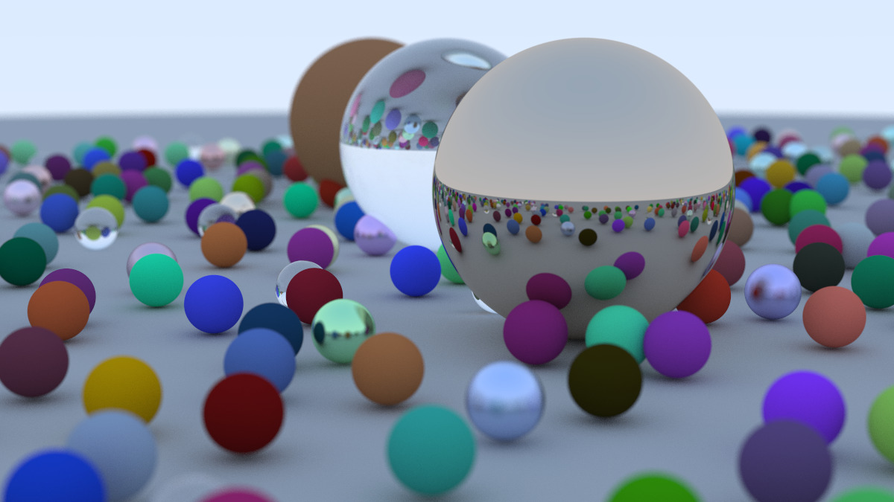

# TinyRayTracer



A minimal ray tracer in modern C++17 built from scratch using [Ray Tracing in One Weekend](https://raytracing.github.io/books/RayTracingInOneWeekend.html) by Peter Shirley.

This project was built from scratch without any graphics libraries to learn the core ideas behind ray tracing — like vector math, ray intersections, light scattering, and camera models. It renders .ppm images and offers a hands-on understanding of how renderers work under the hood.


This project helped me deeply understand the fundamentals of 3D rendering, light physics, shading, and recursive algorithms in graphics programming.

---

## Features

- Ray–sphere intersection
- Diffuse (Lambertian) shading
- Reflective (metal) and refractive (dielectric/glass) materials
- Recursive ray casting with depth control
- Anti-aliasing using Monte Carlo sampling
- Gamma-corrected color output
- PPM image rendering (no external dependencies)
- Modular architecture using polymorphic hittable objects
- Custom `Vec3`, `Ray`, `Camera`, and `Material` classes

---

## Concepts Learned

From first principles to rendering glass and defocus blur, this project helped me explore:

- Linear algebra (dot/cross products, unit vectors)
- Quadratic equation solving for ray-object intersections
- Ray propagation & color blending
- Material scattering: 
  - Lambertian (diffuse reflection)
  - Metal (fuzzy reflection)
  - Dielectric (refraction with Schlick approximation)
- Normals and normal orientation (inside/outside handling)
- Image generation using ray sampling
- Gamma correction: linear → perceptual color space
- Scene construction with polymorphic `hittable` lists
- Rendering pipeline basics

---

## Technical Specs

| Feature                  | Description                                     |
|--------------------------|-------------------------------------------------|
| Language                 | C++17                                           |
| Build System             | Makefile (`make`)                              |
| Output Format            | ASCII `.ppm` image                             |
| Rendering Resolution     | 400×225 (configurable)                         |
| Samples Per Pixel        | 100 (anti-aliasing)                            |
| Max Recursion Depth      | 50 (configurable)                              |
| Dependencies             | None                                           |

---

## Folder Structure

```
tinyraytracer/
├── headers/                   # Core header files for ray tracing engine
│   ├── camera.h               # Camera and viewport setup
│   ├── color.h                # Color utilities and PPM output functions
│   ├── hittable.h             # Abstract class for hittable objects
│   ├── hittable_list.h        # Container for multiple hittable objects
│   ├── interval.h             # Interval utility class (for clamping, etc.)
│   ├── material.h             # Material system (Lambertian, Metal, Dielectric)
│   ├── ray.h                  # Ray class
│   ├── rt_weekend.h           # Constants, random functions, helper utilities
│   ├── sphere.h               # Sphere object definition
│   └── vec3.h                 # Vector math class (Vec3)
├── out/                       # Folder for rendered images
├── Makefile                   # Build instructions
├── README.md                  # Project documentation
├── main.cpp                   # Entrypoint: scene setup, render loop
└── tinyraytracer.h            # Monolithic version of the ray tracer 
```

---

## Building & Running

### Prerequisites

- A C++17-compatible compiler (GCC, Clang, etc.)
- `make` (on UNIX/Linux systems)

### Compile and Run

```bash
make
```

---

## Key Concepts from Implementation

### Vec3 Class
- Overloaded arithmetic ops for 3D vectors.
- Used for positions, colors, normals.
- Has helper functions like `dot`, `cross`, `unit_vector`, etc.

### Ray Class
- Defined by origin `O` and direction `D`: `P(t) = O + t*D`.
- `at(t)` computes point along ray at parameter `t`.

### Sphere Intersections
- Intersection derived from solving a quadratic:  
  Discriminant → # of intersections.  
- Use smallest `t` in `[t_min, t_max]` range for visible hits.

### Normals
- Normal at a point `P` on sphere with center `C`: `normalize(P - C)`
- Handled inside/outside logic via `front_face` boolean.

### Materials
- `scatter()` returns attenuation & scattered ray:
  - Lambertian: random direction in hemisphere
  - Metal: reflect + optional fuzz
  - Dielectric: refract using Snell's law or reflect with Schlick approx

### Anti-Aliasing
- Cast N rays per pixel with random jitter for realism.
- Final color is averaged, then gamma-corrected (`sqrt()` for gamma 2.0).

---

## Planned Enhancements

- [ ] Multi-threaded rendering (OpenMP or std::thread)
- [ ] CUDA acceleration [CUDA example](https://github.com/rogerallen/raytracinginoneweekendincuda)
- [ ] Load `.obj` meshes & tessellate
- [ ] Add PNG/JPG output using `stb_image_write.h`
- [ ] Integrate CMake for cross-platform builds
- [ ] Defocus blur and camera position controls
- [ ] Write a full blog documenting implementation

---


## Acknowledgements

- [Ray Tracing in One Weekend](https://raytracing.github.io/books/RayTracingInOneWeekend.html) – Peter Shirley
